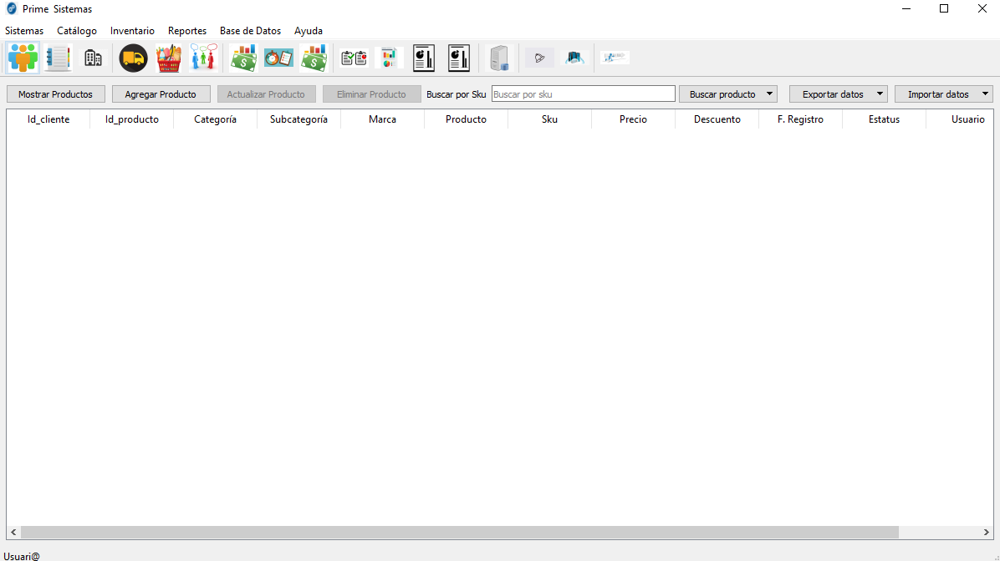

# Prime
Punto de venta escrito en Python con PyQt5

Aplicación de Escritorio, versión beta

Módulo Principal: control.py

Importante instalar correctamente SQL Server:

1. Crear una base de datos con los datos especificados en el archivo xml (ubicado en la carpeta generales)

2. Crear una tabla usuarios con los campos especificados en el models_login (ubicado en la carpeta generales)

3. Crear el usuario (user: "usuario2", password: "usuario2")

# Evidencia

